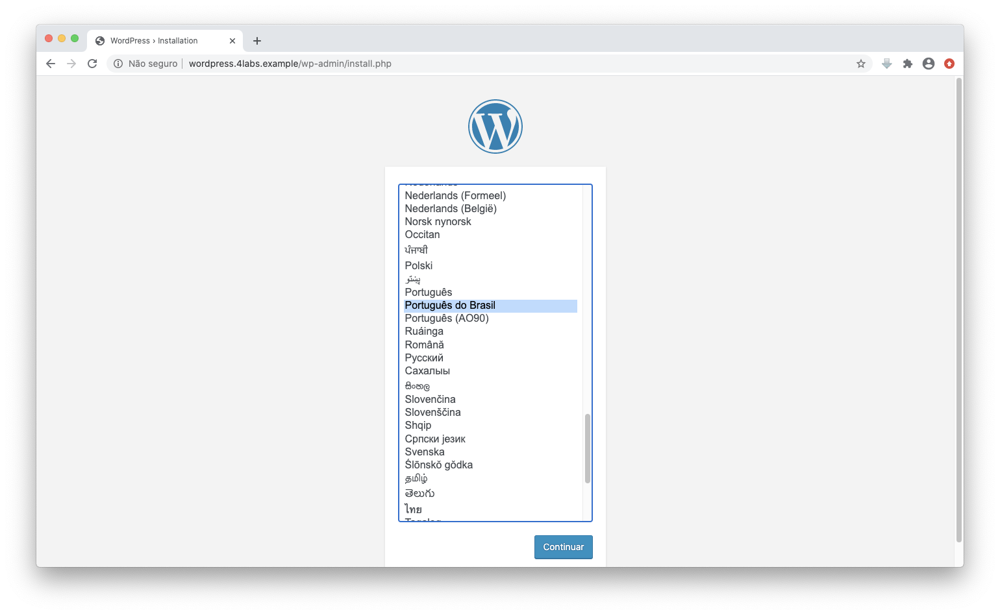
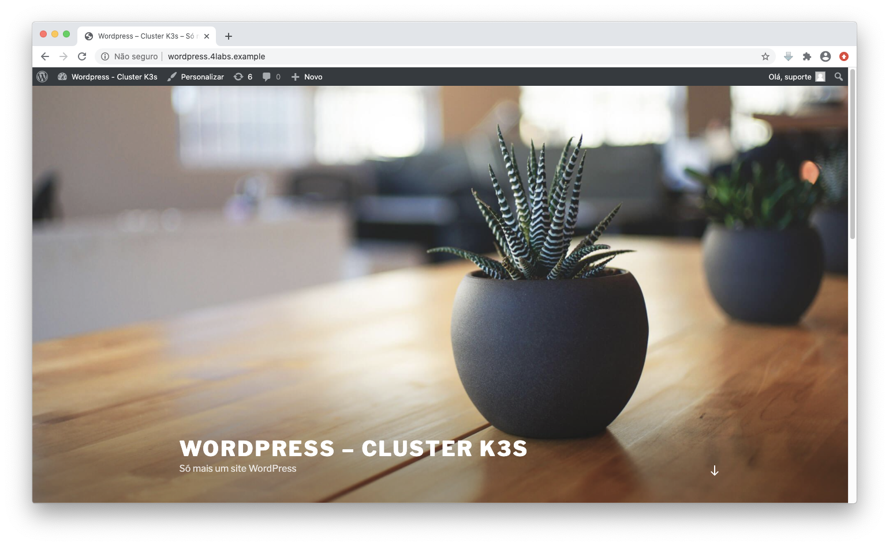

# Wordpress no cluster K3s

Projeto para instalar um cluster kubernetes leve e poucos minutos e nele provisionar um Wordpress.


## Preparando o ambiente

Antes de iniciar o laboratório, é preciso instalar as seguintes aplicações:

1. [Git](https://git-scm.com)
2. [VirtualBox](https://www.virtualbox.org)
3. [Vagrant](https://www.vagrantup.com)


## Iniciar o laboratório

Faça o download dos arquivos disponíveis neste projeto através do **git**:

```
git clone https://github.com/4linux/k3s-lab.git
```

Acesse o diretório k3s-lab e construa a máquina virtual usando o Vagrant:

```
cd k3s-lab
```

```
vagrant up
```


## Acessar a VM

Utilize o comando para acessar o ambiente:

```
vagrant ssh k3s-master
```


## Iniciar o cluster K3s

Execute o comando que cria o cluster Kubernetes com K3S:

```
sudo curl -sfL https://get.k3s.io | INSTALL_K3S_EXEC="server --flannel-iface enp0s8" sh -
```

Após alguns segundos verifique se você já possui um cluster Kubernetes:

```
sudo kubectl get nodes
```

```
NAME         STATUS   ROLES    AGE     VERSION
k3s-master   Ready    master   3h56m   v1.18.9+k3s1
```


## Realizar o Deploy do Wordpress

Em nossa máquina virtual, a pasta **k3s-lab** possui os arquivos YAML para provisionar um Wordpress em nosso cluster K3s:

```
ls k3s-lab
```

```
1-pvc.yaml	2-mysql-deployment.yaml	3-wordpress-deployment.yaml	4-ingress-wordpress.yaml
```

**Descrição dos arquivos**:

- **1-pvc.yaml**:  Cria o recurso PersistentVolumeClaim para o servidor banco MysQL e Wordpress;  
- **2-mysql-deployment.yaml**: Cria os recursos Secret, Service e Deployment para o banco MySQL;
- **3-wordpress-deployment.yaml**: Cria os recursos Service e Deployment para o Wordpress;
- **4-ingress-wordpress.yaml**: Criar o recurso Ingress para acessar o Wordpress através do domínio wordpress.4labs.example.

Aplique as configurações dos arquivos da pasta k3s-lab:

```
sudo kubectl apply -f k3s-lab
```

Verifique se os Pods estão em execução:

```
sudo kubectl get po
```

```
NAME                              READY  STATUS   RESTARTS  AGE
wordpress-mysql-57464b4779-sz7bq  1/1    Running  0         50m
wordpress-6857459697-vcs98        1/1    Running  0         48m
```

Antes de acessar a aplicação do Wordpress, verifique o IP do LoadBalancer:

```
sudo kubectl get svc traefik -n kube-system
```

```
NAME    TYPE         CLUSTER-IP   EXTERNAL-IP     PORT(S)                     AGE
traefik LoadBalancer 10.43.46.222 192.168.200.100 80:31740/TCP,443:32648/TCP  4h
```


## Acessar a aplicação Wordpress no cluster K3s

Adicione uma entrada no arquivo **/etc/hosts** em sua máquina física, apontando para o IP 192.168.200.100, o domínio [wordpress.4labs.example](http://wordpress.4labs.example):

**No Linux e Mac**

* Arquivo: /etc/hosts

  ```text
  ....
  192.168.200.100 wordpress.4labs.example
  ```

**No Windows**

* Arquivo: C:\Windows\System32\Drivers\etc\hosts

```text
....
192.168.200.100 wordpress.4labs.example
```

No Browser de sua máquina Física, acesse o domínio **wordpress.4labs.example** e realize a instalação do Wordpress:



